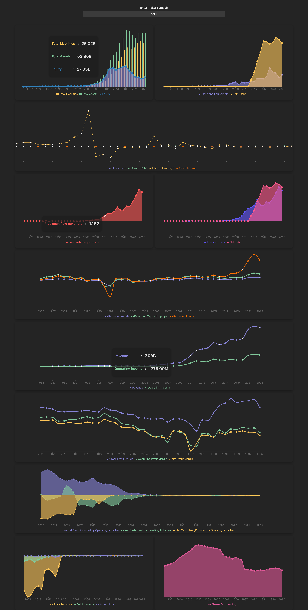

markdown
Copy code

# Financial Dashboard App

This React app provides a financial dashboard that allows users to visualize and analyze financial data for different companies. It includes various components for displaying key financial metrics such as assets and liabilities, debt and cash equivalents, cash flow per share, net debt and free cash flow, returns, revenue and income, margins, cash, acquisitions, and shares outstanding.

## Getting Started

### Prerequisites

Before running the app, ensure you have the following installed:

- [Node.js](https://nodejs.org/)
- [npm](https://www.npmjs.com/) or [yarn](https://yarnpkg.com/)

### Installation

1. Clone the repository:

   ```bash
   git clone https://github.com/your-username/financial-dashboard-app.git

   ```

2. Change into the project directory:

   ```bash
   cd financial-dashboard-app

   ```

3. Install dependencies:

   ```bash
   npm install

   #or

   yarn
   ```

### Running the App

4. Run the app locally with the following command:

   ```bash
   npm start

   #or

   yarn start

   ```

   Open http://localhost:5173 in your web browser to view the app.



Copy and paste it as needed!
